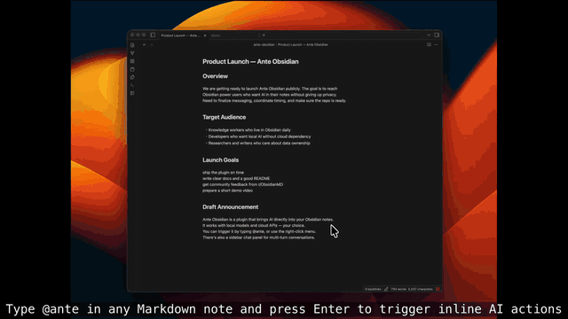
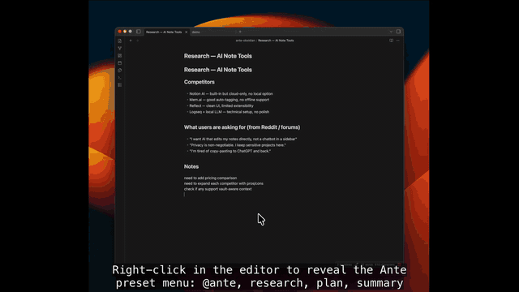
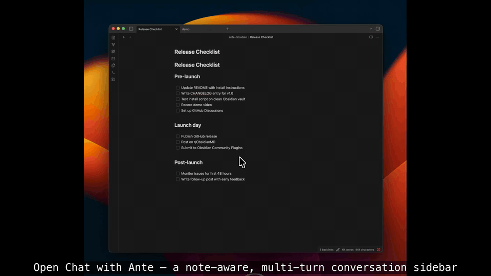
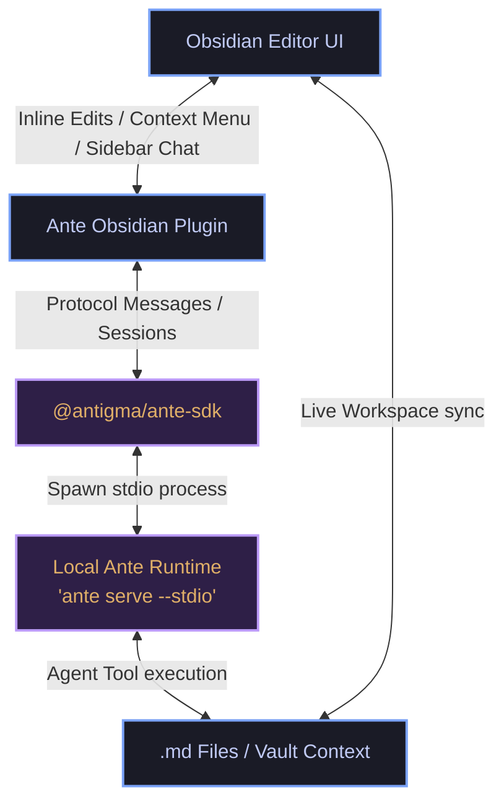

# Ante Obsidian

<p align="center">
  <a href="https://github.com/AntigmaLabs/ante-obsidian/releases"></a>
  <a href="https://obsidian.md"></a>
  <a href="https://github.com/AntigmaLabs/ante-obsidian/blob/main/LICENSE"></a>
</p>

<p align="center">
  <b>English</b> | <a href="./README.zh-CN.md">简体中文</a>
</p>

---

**Ante Obsidian** is a desktop-only Obsidian plugin for Ante-powered Markdown workflows. It bridges note editing, diff review, interactive sidebars, and chat flows with a local agentic runtime, delivering an editorial, note-aware AI second brain.

The repository is organized as a monorepo:

- `packages/ante-obsidian-plugin` — The core Obsidian plugin.
- `packages/ante-sdk` — The reusable TypeScript SDK for programmatically spawning and interacting with the Ante runtime.

---

## 🚀 Quick Start

### 0. For AI Agents (Automated Installation)

```bash
# Step 1: Get vault path (ask user or find from Obsidian config)
VAULT_PATH=$(osascript -e 'tell application "Obsidian" to return path of front window' 2>/dev/null || echo "")

# Step 2: If vault path not found, ask user to provide it
if [ -z "$VAULT_PATH" ]; then
  read -p "Enter your Obsidian vault path: " VAULT_PATH
fi

# Step 3: Run installation script
curl -sS https://raw.githubusercontent.com/AntigmaLabs/ante-obsidian/main/scripts/install.sh | bash -s -- "$VAULT_PATH"
```

### 1. Install or Update the Plugin

You can install the plugin via the official Obsidian Community Plugins catalog (once approved). For manual installs, use the automated installer script below inside your terminal. Running it again updates an existing manual install in the same vault:

```bash
curl -sS https://raw.githubusercontent.com/AntigmaLabs/ante-obsidian/main/scripts/install.sh | bash -s -- /path/to/your/vault
```

Replace `/path/to/your/vault` with your actual Obsidian vault path (same as Step 1 above).

> [!NOTE]
> For manual extraction zip files or detailed developer compilation instructions, please refer to [INSTALL.md](./doc/INSTALL.md).

### 2. Auto-Setup Runtime

The plugin runs completely locally and relies on the `ante` runtime. Setup is fully automated after enabling the plugin:

1. Open **Obsidian Settings** -> **Ante Obsidian**.
2. Under the **Runtime** settings panel, click **Install** to set up the local `ante` runtime automatically.
3. Configure your preferred provider (Gemini, Anthropic, or OpenAI) and verify your key configurations.

---

## ✨ Features

- **⚡ Inline Triggers**: Run document operations directly in Markdown by typing `@ante` and pressing `Enter`.
- **📋 Context Menu Presets**: Quick-access actions like `@ante research`, `@ante plan`, and `@ante summary` from the editor context menu.
- **💬 Chat with Ante**: A note-aware, multi-turn conversation panel focused on reading, editing, and diff-checking with context.
- **🛠️ Preset Customization**: Create, reorder, or hide prompts using drag-and-drop right inside Obsidian settings.

### Feature Demonstrations

**Inline Triggers**


**Context Menu**


**Chat with Ante**


---

## ⚙️ How It Works (Architecture)

Ante Obsidian leverages a lightweight, local-first agent architecture. It streams protocol messages directly over standard input/output (`stdin/stdout`) without needing PTY or heavy terminal emulation, ensuring maximum performance and complete privacy.



---

## 📚 Documentation & Guides

Here is a guide to the project's documentation and resources:

- **System Design Guidelines**: Refer to [doc/DESIGN.md](./doc/DESIGN.md) for visual systems, typography rules, and native UI integration goals.
- **Standalone SDK**: Check the [@antigma/ante-sdk](./packages/ante-sdk/README.md) documentation for installation and programmatic examples.
- **Detailed User Guide**: Consult [doc/USER_GUIDE.md](./doc/USER_GUIDE.md) to understand vault-aware context and inline behaviors.
- **Changelog & Release Notes**: Read [doc/CHANGELOG.md](./doc/CHANGELOG.md) to see the release history and feature additions.

---

## 🛠️ Development

```bash
# Install all dependencies inside the monorepo workspace
npm install

# Start local esbuild in watch mode to output the Obsidian plugin build
npm run dev
```

For detailed development workflows, portable test configurations, and SDK publication steps, please read [doc/CONTRIBUTING.md](./doc/CONTRIBUTING.md).

---

## 📄 License

This project is licensed under the [MIT License](./LICENSE).

---

<p align="center">
  Made with ❤️ by <a href="https://github.com/AntigmaLabs">Antigma Labs</a>
</p>
