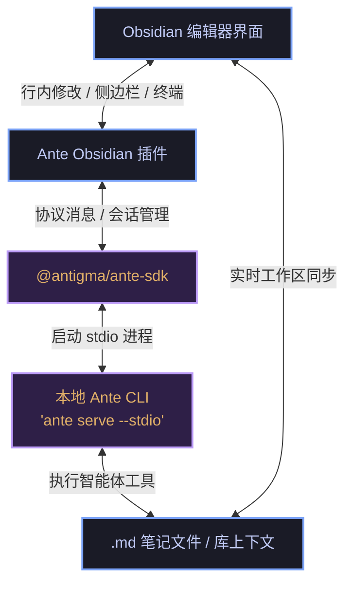

# Ante Obsidian

<p align="center">
  <a href="https://github.com/AntigmaLabs/ante-obsidian/releases"></a>
  <a href="https://obsidian.md"></a>
  <a href="https://github.com/AntigmaLabs/ante-obsidian/blob/main/LICENSE"></a>
</p>

<p align="center">
  <a href="./README.md">English</a> | <b>简体中文</b>
</p>

---

**Ante Obsidian** 是一款专为桌面端 Obsidian 打造的 AI 插件。它将笔记编辑、差异化评审 (Diff Reviews)、交互式侧边栏和对话流无缝连接至本地 **Ante 智能体命令行工具 (Agentic CLI)**，为您提供一个具备极佳笔记感知力与沉静编辑感（editorial calm）的本地 AI 第二大脑。

本项目使用 npm workspaces 组织的 Monorepo 单体多包结构：
*   `packages/ante-obsidian-plugin`: Obsidian 插件核心代码。
*   `packages/ante-sdk`: 可独立使用的 TypeScript SDK，用于在程序中运行和流式调用 Ante CLI。

---

## 关于 Ante

**Ante** 是一款轻量级、本地优先的 AI 智能体运行时，使用 Rust 编写（~15MB 单一二进制，零依赖）。支持 12+ AI 服务商（Anthropic、OpenAI、Gemini 等），并可完全离线运行本地 GGUF 模型。

**了解更多：**
- 📖 [Ante 官方文档](https://docs.antigma.ai)
- 🔗 [Ante GitHub 仓库](https://github.com/AntigmaLabs/ante-preview)
- 📋 [Ante 更新日志与功能](https://github.com/AntigmaLabs/ante-preview/releases)

---

## 🚀 快速上手

### 0. 面向 AI Agent 的自动化安装

```bash
# 第 1 步：获取 Obsidian 库路径（向用户确认，或尝试从 Obsidian 窗口读取）
VAULT_PATH=$(osascript -e 'tell application "Obsidian" to return path of front window' 2>/dev/null || echo "")

# 第 2 步：如果未能自动获取路径，请用户手动输入
if [ -z "$VAULT_PATH" ]; then
  read -p "请输入您的 Obsidian 库路径: " VAULT_PATH
fi

# 第 3 步：运行安装脚本
curl -sS https://raw.githubusercontent.com/AntigmaLabs/ante-obsidian/main/scripts/install.sh | bash -s -- "$VAULT_PATH"
```

### 1. 安装或更新插件
您可以等待插件通过官方社区插件市场审核后一键安装。对于手动安装版本，也可以在终端中运行以下自动化安装脚本；对同一个 Vault 再次运行该脚本会覆盖更新现有手动安装版本（请将 `/path/to/your/vault` 替换为您真实的 Obsidian 库路径）：

```bash
curl -sS https://raw.githubusercontent.com/AntigmaLabs/ante-obsidian/main/scripts/install.sh | bash -s -- /path/to/your/vault
```

> [!NOTE]
> 若要查阅手动解压 Zip 离线包安装或开发者本地编译构建的步骤，请参考 [doc/INSTALL.zh-CN.md](./doc/INSTALL.zh-CN.md)。

### 2. 本地命令行工具配置
插件完全在本地运行，并依赖 `ante` 命令行工具。启用插件后，配置完全自动化：
1. 打开 **Obsidian 设置** -> **Ante Obsidian**。
2. 在 **Runtime** 设置面板下，点击 **Install** 按钮，插件将为您自动下载并安装本地的 `ante` CLI。
3. 选择您喜欢的模型服务商（Gemini、Anthropic 或 OpenAI）并配置相应的 API Key 凭证。

---

## ✨ 核心特性

*   **⚡ 行内触发**: 直接在笔记中输入 `@ante` 并回车（`Enter`），即可在光标处流式运行并直接修改当前段落或选区。
*   **📋 上下文菜单预设**: 通过鼠标右键，一键运行 `@ante research`（研究）、`@ante plan`（策划）和 `@ante summary`（总结）等常用预设。
*   **💬 智能体对话**: 提供具备笔记上下文感知的侧边栏多轮对话面板，支持代码差异化评审（Diff）和文件无缝读写。
*   **💻 Ante 终端**: 控制台风格的交互流，流式输出详细执行日志并展示自研的工具调用安全审批卡片。
*   **🛠️ 自由定制预设**: 支持在设置面板中通过鼠标拖拽，灵活自定义、重排序或隐藏所有的快捷预设动作。

---

## ⚙️ 工作原理 (架构图)

Ante Obsidian 采用轻量化、本地优先的智能体架构。它通过标准输入输出 (`stdin/stdout`) 实时流式传输协议消息，无需依赖复杂的 PTY 虚拟终端或繁重的终端模拟器，从而实现极致性能与完整的隐私保护。



插件仅支持桌面端，因为它需要启动本地 Ante CLI，并读取 `~/.ante/settings.json` 中的本地 Ante 默认配置。库内文件的读写均通过 Obsidian Vault API 完成；临时文件系统读取仅用于插件自己生成的 staged diff 预览。剪贴板访问只在用户点击复制按钮后写入文本，不读取剪贴板内容。

---

## 📚 相关文档与参考指南

本仓库提供了完整的用户指南、开发规范和更新记录文件：
- **设计规范**: 请阅读 [doc/DESIGN.md](./doc/DESIGN.md) 了解本插件的视觉设计系统、排版规则及 native 嵌入的体验目标。
- **独立 SDK**: 查阅 [@antigma/ante-sdk](./packages/ante-sdk/README.md) 文档，学习如何独立导入 SDK 并进行流式编程。
- **用户详细指南**: 阅读 [doc/USER_GUIDE.md](./doc/USER_GUIDE.md) 深入了解库感知上下文、行内占位符等交互机制。
- **更新日志与发布历史**: 查阅 [doc/CHANGELOG.md](./doc/CHANGELOG.md) 了解版本的变动细节与新增特性。

---

## 🛠️ 本地开发

```bash
# 在 monorepo 工作区内安装所有依赖
npm install

# 启动本地 esbuild 监听模式以持续编译生成 Obsidian 插件
npm run dev
```

如需获取更多关于本地开发流程、便携式测试环境以及 SDK 打包发布的说明，请参考 [doc/CONTRIBUTING.md](./doc/CONTRIBUTING.md)。

---

## 📄 开源许可证

本项目基于 [MIT 许可证](./LICENSE) 开源。

---
<p align="center">
  Made with ❤️ by <a href="https://github.com/AntigmaLabs">Antigma Labs</a>
</p>
